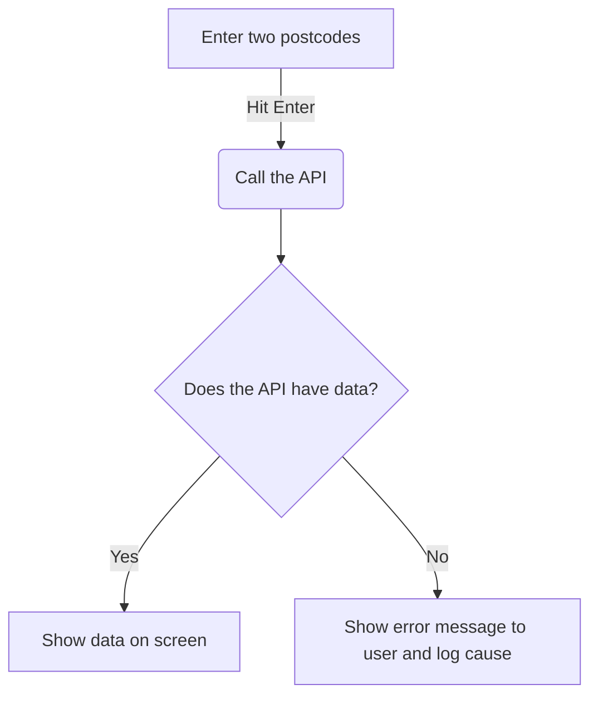

# Welcome to my Postcode Project

Written in **C#** using **Visual Studio**.
The main goal of this project is as follows - Enter two postcodes and find the distance between them.
I wanted to go further than this and use the resources I had available to create something better.
The code is seperated into frontend and backend. In the frontend folder, everything relating to the display is included.
In the backend folder, you have helpers (googleAPI functions and validation functions) along with the main backend code which calls these functions when required.
Watch this YouTube video to see the functionality: https://www.youtube.com/watch?v=NfVasgFEEkE

Features of this software:

 - UK Postcode validation using regex
 - Total driving distance between two postcodes
 - Total driving time between two postcodes
 - Origin and destination information is shown
 - Toggle button to switch between miles and km
 - Logging feature which logs to external file in same directory
 - Unit testing using MSTest framework

## Test Cases for Unit Tests
**checkAPIWithValidPostcodes**: This test should pass if the API call is not successful at recieving a response with valid 	postcodes. The API status should returns "OK"
**checkAPIWithInvalidPostcodes**: This test should pass if the API call is not successful at recieving a response with valid 	postcodes. The API status should returns "NOT_FOUND"
**checkIfPostcodesAreValid**: This test should pass if the postcodes are valid and recieves a true boolean value from the helper function
**checkIfPostcodesAreInvalid**: This test should pass if the postcodes are invalid and recieves a false boolean value from the helper function
**checkIfDataIsParsed**: This test should pass if the data is parsed correctly and the origin value contains the original origin postcode

## How to use this software?

 1. Open postcode_project.exe
 2. Enter a postcode into the first input field
 3. Enter another postcode into the second input field
 4. Hit enter on  your keyboard (or press submit)
 5. If all goes well you will see the data show up in the window!

## What did I use to create this?

 - C#
 - Visual Studio 2022
 - Google Maps API
 - Log4Net
 - MaterialSkin
 - Newtonsoft JSON Parsing

## A very simple workflow on how this works

